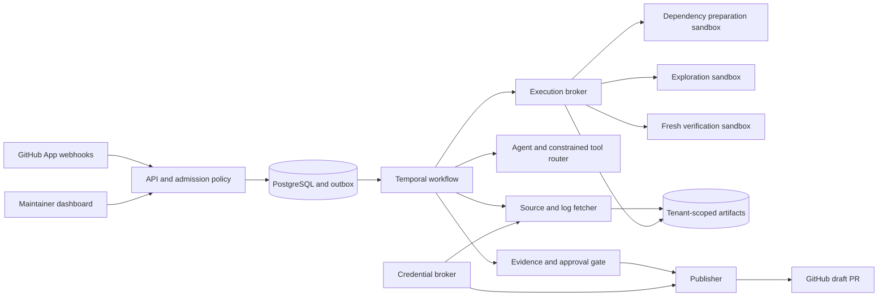

# TraceFix: Enterprise Build Specification

Version 1.0 · September 7, 2026

**Purpose:** Build an AI service that investigates failed GitHub Actions runs, reproduces supported Python defects, proposes a small patch, independently verifies it, and prepares an approval-gated draft pull request.

This document is an implementation specification. The architecture, limits, milestones, and performance thresholds below are design choices and release targets, not claims that the project already exists or has achieved them.

## 1. Product definition and scope

TraceFix should answer four questions for a developer: What failed? Can we reproduce it? Does this patch fix it without breaking the supported regression suite? What exactly will be published?

The primary user is a repository maintainer. Organization administrators control repository access, execution policy, model providers, budgets, and publishing. Security reviewers inspect evidence and audit records.

Deliver this complete journey:

1. An administrator installs the GitHub App on selected repositories and approves an execution profile.
2. A supported GitHub Actions run fails. TraceFix authenticates the event and captures the exact run attempt and source revision.
3. TraceFix checks eligibility, fetches bounded context, and reproduces the failure in an isolated environment.
4. An agent inspects relevant code, proposes a bounded patch, and requests approved tests.
5. A separate verifier applies that patch to a fresh copy of the pinned source and runs the required checks.
6. The maintainer reviews diagnosis, diff, test evidence, cost, and limitations in the dashboard.
7. After approval and a final policy check, a publisher opens a draft PR or provides a downloadable patch when repository workflows make publication unsafe.

### Initial supported cohort

- GitHub.com repositories explicitly onboarded by a maintainer.
- Linux Python projects using pytest; initially support pinned Python 3.11–3.13 profiles.
- Default-branch push runs and approved same-repository PR workflows whose exact checkout revision can be established.
- Deterministic source defects reproducible without production credentials, internet access during tests, privileged services, or private infrastructure.
- Dependencies resolved from approved, hash-pinned wheels. Explicitly reject unsupported source builds and installation methods in the first release.
- Source-only fixes within configured paths, with a maximum of three candidates per investigation.

Classify infrastructure outages, missing credentials, dependency download failures, unsupported environments, and suspected flaky tests separately. Return an explanation and evidence when a case is outside scope. Do not change application code to conceal an environmental failure.

Defer arbitrary language support, fork PRs, arbitrary workflow emulation, dependency/lockfile repair, Windows/macOS reproduction, auto-merge, and production deployment changes until separate designs and acceptance tests exist. These are expansion tracks, not unfinished core requirements.

## 2. Architecture and technology decisions

Use one monorepo and a small number of deliberately separated deployment identities. Share schemas and libraries; separate services where credentials or hostile execution require a boundary.

| Component | Default technology | Responsibility |
|---|---|---|
| API/control plane | Python 3.12, FastAPI, Pydantic v2 | Authentication, authorization, webhook ingress, policy, read APIs |
| Persistence | PostgreSQL 17, SQLAlchemy 2, Alembic | Tenant records, run projections, approvals, budgets, audit, outbox |
| Durable orchestration | Temporal Python SDK | State transitions, retries, cancellation, timers, recovery |
| Agent | Anthropic SDK behind a provider interface | Structured diagnosis and bounded patch proposals |
| Code retrieval | ripgrep plus Python AST indexing | Traceback-, diff-, and symbol-based context selection |
| Web application | React, TypeScript, Vite | Run timeline, evidence, diff review, policy and usage screens |
| Artifact storage | S3; an S3-compatible local emulator | Source snapshots, patches, logs, reports, attestations |
| Execution | Local Docker; production gVisor on dedicated Linux Kubernetes nodes | Disposable preparation, exploration, and verification environments |
| Authentication | OIDC provider; Keycloak for local integration testing | SSO, session identity, organization membership mapping |
| Observability | OpenTelemetry, Prometheus, Grafana | Traces, operational metrics, dashboards and alerts |
| Delivery | GitHub Actions, Terraform, Helm | Tested builds, infrastructure, deployment and rollback |

Pin exact compatible versions, model IDs, GitHub API version, and container digests during bootstrap. Commit lockfiles and an upgrade policy. Do not use floating `latest` tags in deployment or benchmark manifests.

Temporal owns the durable state machine. Put model calls, GitHub calls, database operations, and sandbox operations in Activities. Do not introduce a second independent workflow state machine in LangGraph. Temporal replay and Activity retries do not make external writes exactly-once; implement idempotency and reconciliation explicitly. [Temporal Python SDK](https://github.com/temporalio/sdk-python)

Start retrieval with tracebacks, changed files, imports, symbol references, and bounded search. Add embeddings only if an evaluation demonstrates an improvement at acceptable cost. No vector database is required for version one.



The diagram's arrows are logical interactions. In production, use authenticated service calls and broker-mediated artifact transfer; no sandbox receives general object-store, database, GitHub, cloud, or model credentials.

## 3. Repository layout and developer workflow

Create this structure:

```text
tracefix/
  apps/api/                    # FastAPI routes and middleware
  apps/web/                    # React dashboard
  services/orchestrator/       # Temporal workflows and Activities
  services/executor/           # Sandbox lifecycle broker and adapters
  services/publisher/          # Approval-bound GitHub writes
  services/credential_broker/  # Installation token minting
  packages/domain/             # Shared typed contracts and state definitions
  packages/github/             # GitHub REST client and payload schemas
  packages/agent/              # Prompts, tool router, provider adapter
  packages/policy/             # Admission, patch, publication decisions
  packages/verification/       # Trusted harness and evidence checks
  packages/storage/            # Tenant-scoped DB and artifact access
  migrations/
  evals/tasks/                 # Public development tasks and manifests
  evals/runner/                # Evaluation CLI; held-out tasks stored separately
  tests/unit/
  tests/integration/
  tests/security/
  tests/e2e/
  tests/chaos/
  deploy/local/
  deploy/helm/
  infra/terraform/
  docs/adr/
  docs/runbooks/
  pyproject.toml
  uv.lock
  pnpm-lock.yaml
  Taskfile.yml
  .env.example
```

Use `uv` for Python dependencies and `pnpm` for the frontend. Run local orchestration and Docker fixtures under WSL2/Linux on Windows; production sandbox tests require the actual Linux runtime. Document prerequisites and verified versions.

Implement these commands as the project's developer interface; they are required deliverables, not existing commands:

```text
task bootstrap                 # Validate prerequisites; install locked dependencies
task dev                       # Start infrastructure, migrations, API, workers and UI
task demo                      # Execute a deterministic owned sample failure
task lint                      # Ruff, Python typing, TypeScript and frontend lint
task test:unit
task test:integration
task test:security
task test:e2e
task test:chaos
task eval -- --split development --output artifacts/evaluation.json
task build                     # Build versioned deployment images
task verify:staging            # Run production-runtime acceptance checks
```

Provide a fixture provider for deterministic tests and a real-provider integration mode. Label simulated runs visibly. The demo must work through the actual API, workflow, executor, and UI; a canned final response is not an end-to-end demo.

## 4. GitHub integration and event ingestion

### Permissions and credentials

Register a GitHub App with Actions read, Contents write, and Pull requests write for the full publication product. Add Checks write only if publishing check runs is implemented. Do not request Administration, Secrets, or Workflows permissions.

Keep the App private key only in a credential broker with restricted service identity and managed secret storage. Mint repository-scoped reader tokens with Actions read/Contents read and separate publisher tokens with Contents write/Pull requests write. A diagnostic-only deployment can use an App installation with read-only permissions. Installation tokens can be narrowed by repositories and permissions. [GitHub installation tokens](https://docs.github.com/en/rest/apps/apps#create-an-installation-access-token-for-an-app)

The broker must authorize each request by authenticated service identity and operation type. Resolve installation, tenant, repository, and allowed permission scope from trusted persisted records; never accept arbitrary requested permissions or installation IDs as authority. A fetcher or orchestrator identity cannot mint a write token. A publisher request must reference an eligible, approved publication operation for that same tenant and repository. Reject cross-tenant requests even when the App is installed on both repositories.

No token goes into a repository checkout, model prompt, execution environment, URL, trace attribute, or persistent log. Rotate the App key and webhook secret through a documented procedure.

### Ingress sequence

1. Enforce HTTPS, a bounded request body, accepted content type, and supported event types.
2. Verify `X-Hub-Signature-256` against the original body bytes using HMAC-SHA256 and constant-time comparison before parsing for processing. [GitHub signature validation](https://docs.github.com/en/webhooks/using-webhooks/validating-webhook-deliveries)
3. Transactionally persist the delivery, logical-run admission request, and outbox event. Return a success response only after durable commit.
4. Deduplicate delivery IDs separately from logical run keys. Delivery IDs are transport metadata; logical deduplication must also use verified run information.
5. Fetch installation access, repository identity, run conclusion, run attempt, jobs, and exact-attempt logs from GitHub. Do not fetch arbitrary URLs supplied by event text or the model. Handle authenticated API redirects without forwarding credentials to unrelated hosts. [Workflow run API](https://docs.github.com/en/rest/actions/workflow-runs)
6. Reconcile missed eligible runs using an overlapping cursor and the same logical deduplication keys. GitHub does not automatically redeliver failed webhook deliveries. [Failed delivery handling](https://docs.github.com/en/webhooks/using-webhooks/handling-failed-webhook-deliveries)

Use an initial logical key of installation ID, repository ID, workflow run ID, run attempt, policy version, and verified execution SHA. Resolve provisional ingestion records before starting costly execution. A manual retry gets a new request identity and an explicit parent-run link; it does not bypass the publication deduplication key.

### Source provenance

Record source head SHA, target base SHA, and actual execution SHA separately. A PR run can test a synthetic merge revision or a custom checkout; never assume `head_sha` alone proves what was executed.

For default-branch push failures, branch the candidate from the recorded failed commit. For supported PR failures, reproduce the approved merge composition and evaluate the proposed source patch against that composition. Require a trusted checkout recipe or trusted provenance manifest that can establish the actual tree. Otherwise return `UNSUPPORTED_CHECKOUT`.

The fetcher must use safe archive extraction or hardened Git invocation: no checkout hooks, recursive submodules, external filters, LFS helpers, repository-supplied Git configuration, unbounded files, or escaping symlinks. Preserve hashes of every input artifact.

## 5. Trusted repository policy

Store policy in TraceFix's administrator-controlled configuration database. A protected default-branch file may propose changes, but an authorized administrator must approve the resolved policy version. A failed branch, PR description, log, or repository `AGENTS.md` cannot grant permissions.

The following illustrates the required configuration schema:

```yaml
schema_version: 1
mode: approval_required
eligible_events: [push, pull_request]
allow_forks: false
execution_profile: python312-pytest-v1
workflow_ids: [123456]
source_paths: [src/]
protected_paths:
  - .github/
  - tests/
  - conftest.py
  - '**/conftest.py'
  - pyproject.toml
  - pytest.ini
  - uv.lock
  - requirements*.txt
  - deploy/
  - infra/
limits:
  candidates: 3
  changed_files: 5
  changed_lines: 250
  investigation_seconds: 900
  sandbox_seconds: 300
  sandbox_vcpu: 2
  sandbox_memory_mib: 4096
  sandbox_pids: 256
  sandbox_disk_mib: 2048
  max_source_files: 20000
  max_expanded_source_mib: 200
  max_expanded_logs_mib: 50
  model_input_tokens_total: 60000
  model_output_tokens_total: 10000
  reserved_model_cost_usd: 2.00
publication:
  draft_only: true
  approval_ttl_seconds: 1800
  require_workflow_safety_review: true
```

These limits are starting product defaults. Make them configurable below platform maximums and tune them with measured workloads. Define whether line limits count additions plus deletions, normalize paths before matching, and test wildcard behavior.

The investigation duration bounds active investigation work and excludes queue delay and human approval waiting; configure separate queue expiry and approval TTL. Infrastructure retries consume time and cost but do not count as a new candidate unless a different patch is generated. Measure billable sandbox resources as well as model tokens.

Execution profiles define commands as argument arrays and approved environment variables, not model-generated shell strings. Profiles and harnesses are platform-owned, immutable, and versioned. Initial profiles use offline dependency artifacts and a pinned pytest runner with unapproved plugin autoload disabled.

## 6. Durable workflow and recovery

Implement this primary progression:

```text
RECEIVED -> ADMITTED -> SNAPSHOTTED -> BASELINE_RUNNING
-> REPRODUCED -> DIAGNOSING -> PATCH_PROPOSED
-> VERIFYING -> AWAITING_APPROVAL -> PUBLISHING -> PR_OPENED
```

Alternative terminal outcomes include `IGNORED`, `UNSUPPORTED`, `UNREPRODUCIBLE`, `FLAKY_SUSPECTED`, `POLICY_BLOCKED`, `NO_VALID_PATCH`, `BUDGET_EXCEEDED`, `STALE`, `EXPIRED`, `CANCELLED`, and `SYSTEM_ERROR`. Attach typed reason codes rather than requiring operators to interpret logs.

Failed verification may return to diagnosis within the candidate and cost budgets. A transient infrastructure error is different from a failing test; retry only the former automatically. A malformed model response can receive one bounded schema-repair attempt within the same budget.

Every transition records actor/service, timestamp, reason, workflow ID, policy version, and references to evidence. Temporal history is the orchestration authority; PostgreSQL is the transactional domain store and UI projection. Use idempotent projection updates and a reconciler so replay cannot advance the visible state incorrectly.

Use a transactional outbox to start workflows. If the dispatcher starts a workflow and crashes before recording success, the stable workflow ID makes the next dispatch recover the existing workflow.

Configure per-Activity timeouts, retryable error categories, exponential backoff, provider rate-limit handling, and long-running sandbox heartbeats. All external writes use a persistent operation identity and read-after-timeout reconciliation. Do not promise exactly-once execution across GitHub, storage, and Temporal.

Cancellation, installation removal, repository deselection, policy revocation, and budget exhaustion must prevent new work and stop active sandboxes through an external lifecycle controller. Keep a sweeper for expired leases and abandoned resources, independent of workflow health.

## 7. Agent design and context construction

Use a single bounded agent initially. Its job is to produce a diagnosis and a patch proposal. Deterministic code decides access, resource budgets, test execution, and publication.

Construct context in this order: failed job and step; normalized traceback; relevant changed lines; referenced symbols and imports; nearby source; relevant original tests. Preserve citations as source path, revision, and line range. Store a context manifest with hashes and truncation decisions.

Repository content, logs, artifacts, test output, comments, and model responses are untrusted. Delimit them as evidence, strip unsafe terminal controls, cap sizes, and redact likely secrets before model calls. Redaction is best-effort; private-code organizations must explicitly choose an approved provider, allowed data classes, retention settings, and processing region.

Expose only these typed tools:

```text
read_file(snapshot_id, relative_path, start_line, end_line)
search_code(snapshot_id, query, allowed_paths, result_limit)
get_diff(snapshot_id)
submit_patch(snapshot_id, unified_diff)
request_test(candidate_id, approved_profile_id, permitted_test_ids)
```

Resolve tenant and run authorization in the server-side tool router for every call. The model cannot select another tenant, widen its own policy, access the internet, run arbitrary shell commands, obtain credentials, or publish to GitHub. Tool descriptions come from the deployed application, not the repository.

Require schema-validated diagnosis output containing failure category, relevant evidence references, hypothesis, proposed changed paths, expected behavior, and known limitations. An LLM confidence score is explanatory metadata, not a release gate.

A patch validator must reject escaping paths, binary files, symlink changes, forbidden file modes, submodule changes, oversized diffs, protected files, and hunks that do not apply cleanly. Include secondary checks for obvious attempts to skip tests, suppress assertions, alter harness behavior, or exfiltrate data. These checks supplement human review and execution; they do not prove semantic correctness.

## 8. Dependency preparation and sandbox lifecycle

Provide one executor interface with separate local and production implementations. A job specification includes tenant/run identity, signed execution capability, source digest, image digest, dependency bundle digest, approved profile, resource limits, and expiry. It does not accept arbitrary host mounts, images, service accounts, URLs, or Kubernetes specifications from callers.

Use three distinct disposable environments:

1. **Preparation:** Resolve approved dependency artifacts through a controlled package mirror. Keep repository installation/build hooks inside the sandbox. Initial support uses pinned wheels and rejects unsupported builds. The download broker holds any registry credentials and transfers only authorized artifacts.
2. **Exploration:** Let the agent inspect context and request limited tests against proposed patches.
3. **Verification:** Start from a fresh source snapshot and immutable dependency/image digests; the agent cannot mutate this workspace or its runner.

Production execution requires a dedicated Linux execution pool with gVisor `runsc`, an explicit Kubernetes RuntimeClass, and verified network enforcement. Ordinary Docker is the local developer backend, not the production hostile-code boundary. gVisor reduces host kernel exposure but still requires a secure surrounding architecture. [gVisor security model](https://gvisor.dev/docs/architecture_guide/security/)

Enforce non-root execution, a read-only root filesystem, dropped capabilities, approved syscall policy, no privilege escalation, no host networking, no hostPath mounts, no container runtime socket, and no service account token mounted into jobs. Give each run an isolated writable workspace and temporary directory with CPU, memory, PID, disk, output-size, and wall-clock limits.

Deny all test-stage egress, including DNS, cloud metadata, control-plane endpoints, internal networks, neighboring tenants, GitHub, and model APIs. Prove this with connection tests on the deployed CNI; a NetworkPolicy object alone is insufficient if the network implementation does not enforce it. [Kubernetes NetworkPolicy](https://kubernetes.io/docs/concepts/services-networking/network-policies/)

A trusted broker stages inputs and collects bounded outputs. The guest must not hold reusable artifact-store credentials. Cache only immutable artifacts; scope private caches by tenant and dependency/image digests, and never allow an untrusted job to replace a shared artifact.

The lifecycle controller must terminate process trees, remove volumes, and reap resources even if the agent, workflow worker, or API crashes. Record cleanup completion. Maintain an emergency stop switch for the whole pool and each tenant.

## 9. Independent patch verification

Implement verification before optimizing the model's repair rate.

1. Establish the baseline environment from pinned source, runtime image, dependencies, profile, and original test inventory.
2. Run the target test twice. Require the same normalized failure signature; inconsistent outcomes become `FLAKY_SUSPECTED` and receive no repair claim. Two runs are a screening heuristic, not proof of determinism.
3. Run the applicable original regression suite and record existing failures, collection errors, skips, and test IDs.
4. Validate the candidate diff, then apply it to a separate clean snapshot.
5. Re-run the targeted failure and the same full approved regression profile. Require the target to pass, no new failures, no unexplained test disappearance or skips, and no changes to protected test/harness configuration.
6. For the first release's full-verification badge, require a cohort where the baseline suite is otherwise passing and the entire selected candidate suite passes. If a broader project has existing failures or an incomplete supported matrix, label the result accurately and withhold that badge.
7. Execute available independent behavior probes. In benchmark mode, keep held-out tests out of the agent's workspace and prompts.
8. Create an immutable verification record bound to source/execution/base revisions, patch digest, candidate tree digest, image, dependencies, test profile, harness version, policy version, results, and timestamp.

The trusted executor supervisor owns timing, process exit, artifact hashing, and result collection. Treat stdout and JUnit XML as untrusted input: parse defensively, compare test inventory, and reject fabricated or incomplete evidence. Candidate code can interfere with a Python test process; even protected tests and green execution do not prove a patch is harmless. Human review remains part of the product's publication flow.

The publisher must consume the exact verified source patch and attestation. It must never ask the model to regenerate the patch after verification or silently rebase it onto a different tree.

This outcome-focused evaluation design follows the distinction between an agent's explanation and independently checked task results. [Anthropic agent evaluation guidance](https://www.anthropic.com/engineering/demystifying-evals-for-ai-agents)

## 10. Publication and GitHub race handling

Treat pushing a branch and opening a draft PR as privileged actions with external side effects. Draft status does not prevent GitHub Actions from running; App-token events can trigger workflows. The repository's push, pull-request, and chained workflow behavior must be reviewed before enabling publication. [GitHub workflow triggering](https://docs.github.com/en/actions/how-tos/write-workflows/choose-when-workflows-run/trigger-a-workflow)

The onboarding review must establish that candidate code cannot execute with repository secrets, dangerous write tokens, cloud credentials, or privileged/self-hosted runners in any affected workflow path. Include composite/reusable actions, indirect triggers, and called scripts. If this cannot be established, use patch-download mode and explain the missing admission condition. Never execute untrusted checkout code in a privileged `workflow_run` or `pull_request_target` workflow. [GitHub Actions secure use](https://docs.github.com/en/actions/reference/security/secure-use)

Store a versioned safety-review fingerprint of relevant workflow files, resolved reusable/composite action revisions, runner assignments, token permissions, and observable repository/organization security settings. Revalidate those inputs before every publication, not just during onboarding. A changed or unverifiable fingerprint invalidates publication admission. Use an explicitly approved read-only review integration where additional settings visibility is needed; do not silently widen the normal App's permissions. Repositories whose safety configuration cannot be established remain in patch-download mode.

Immediately before publishing:

- Verify current installation access, repository membership, repository policy, approval authority, evidence validity, and candidate digest.
- Revalidate the workflow-safety fingerprint and settings visibility; require a fresh review when affected workflow behavior or runner/credential configuration changed.
- Bind approval to the patch hash, source/base SHAs, policy version, evidence ID, approver, and expiry. Changed input invalidates approval.
- Refetch relevant source and base refs. If they advanced, mark the run stale and start a new verification cycle; do not reuse old approval.
- Acquire a publication lock using a stable key derived from tenant, repository, GitHub workflow run ID, and run attempt. Enforce one publication record per logical failed run attempt, including across manual retries or policy revisions; store the approved candidate digest in that record rather than using it to create a different lock.
- Create a deterministic bot branch such as `tracefix/run-123-attempt-2` from the verified source SHA. Use GitHub APIs rather than executing checkout code in the publisher. If a PR already exists for that logical failure, return its identity instead of automatically opening another candidate PR; require a separately designed, approval-bound update flow before replacing an existing proposal.
- Reconcile existing refs and PRs after ambiguous errors. Never blindly retry a branch write or PR create after an API timeout.
- Refuse to overwrite a bot branch containing human changes. Never force-push, merge, change protection rules, or add credentials.

GitHub reads and writes are not one atomic transaction. Recheck after publication and mark the PR stale if a race is detected; require repository CI and branch protection to validate the current merge state. Do not represent prepublication checks as eliminating every base-change race.

For a PR-originated failure, publish to an approved branch targeting the recorded same-repository source branch, clearly link the original PR, and explain the downstream base against which it was tested. Do not modify the contributor's branch directly.

A PR body must include the original failed run, diagnosis with evidence references, patch summary, exact revisions, reproduced failure, executed tests, skipped/unsupported checks, verification report, and a clear AI-generated change disclosure. Ignore TraceFix branches and known bot-generated commits during ingestion to prevent repair loops.

## 11. Data model and tenant boundaries

Use UUID public IDs, UTC timestamps, explicit foreign keys, and tenant-scoped uniqueness. Every tenant-owned record includes `tenant_id`; use composite foreign keys where needed to prevent a child from referencing another tenant's parent.

| Entity | Required data |
|---|---|
| tenants and memberships | Organization identity, OIDC mapping, role, status, limits |
| installations and repositories | GitHub numeric IDs, selected access, policy version, mode |
| repository_policies | Immutable policy document, version, approver, effective timestamp |
| webhook_deliveries and outbox | Delivery identity, payload digest, admission status, dispatch state |
| repair_runs | GitHub run/attempt, source/base/execution SHA, state, reason, parent, workflow ID |
| candidates | Iteration, patch/artifact digests, changed files, model/prompt versions, validation |
| executions | Sandbox identity, stage, image/dependency/profile hashes, limits, status, cleanup |
| verification_records | Baseline/candidate tests, evidence digests, signed attestation, limitations |
| approvals and publications | Approval scope/expiry, publication operation ID, branch, PR, reconciliation |
| model_calls and usage_ledger | Provider, model, tokens, reserved/actual costs, pricing version |
| artifacts and audit_events | Tenant-bound storage keys, hashes, access class, retention, actor/action |

Implement API authorization and PostgreSQL row-level security as complementary controls. The runtime DB role must not own protected tables, be a superuser, or have `BYPASSRLS`. Set tenant context transaction-locally, handle connection pooling safely, use both `USING` and `WITH CHECK` policies, and test owner/bypass behavior explicitly. [PostgreSQL row security](https://www.postgresql.org/docs/17/ddl-rowsecurity.html)

Background jobs resolve tenant context from trusted persisted records, never from model output. Artifact downloads, event streams, exports, cache keys, approval operations, and search queries must enforce the same tenant boundary. An unguessable ID is not authorization.

## 12. API contracts

Publish OpenAPI and generate a typed frontend client. Use cursor pagination, bounded filters, consistent error codes, request IDs, and idempotency keys for mutation endpoints.

| Endpoint | Required behavior |
|---|---|
| `POST /webhooks/github` | Signature verification, durable ingestion, deduplication |
| `GET /v1/repositories` | Authorized repository inventory and mode |
| `PUT /v1/repositories/{id}/policy` | Admin-only, versioned update with optimistic concurrency |
| `POST /v1/repositories/{id}/repair-runs` | Authorized manual investigation of an eligible exact run attempt |
| `GET /v1/repair-runs` | Tenant-scoped paginated filters |
| `GET /v1/repair-runs/{id}` | Current state, revisions, costs, evidence and limitations |
| `GET /v1/repair-runs/{id}/events` | Authenticated server-sent events with resumable cursor |
| `POST /v1/repair-runs/{id}/cancel` | Idempotent cancellation and executor teardown |
| `POST /v1/repair-runs/{id}/retry` | Linked new attempt, quota/admission checks |
| `POST /v1/candidates/{id}/approve` | Digest-bound approval by authorized maintainer |
| `POST /v1/candidates/{id}/publish` | Evidence/approval gate and idempotent publication request |
| `GET /v1/artifacts/{id}` | Authorized redacted content or short-lived bounded download |
| `GET /v1/usage` and `/v1/audit-events` | Role-filtered cost and audit views |

Return structured errors with `code`, safe `message`, `request_id`, and `retryable`. Include cases such as `POLICY_DENIED`, `SOURCE_MOVED`, `BUDGET_EXCEEDED`, `UNSUPPORTED_PROFILE`, and `PROVIDER_UNAVAILABLE`. Never return secrets or raw internal exceptions.

## 13. Dashboard requirements

Build a working product UI with real API data:

- **Overview:** active runs, verified candidates, unsuccessful outcomes, queue age, and spend over an explicit interval.
- **Run detail:** state timeline, failed run link, source revisions, evidence-backed diagnosis, baseline/candidate results, resource usage, cost, and cancellation.
- **Patch review:** side-by-side diff, protected-file decisions, test inventory, verification limitations, approval expiry, publish/download action.
- **Repository settings:** eligibility, supported profiles, path restrictions, provider approval, budgets, publication mode and admission status.
- **Organization settings:** SSO membership mapping, roles, integrations, retention, emergency stop, audit export.

Implement loading, empty, partial-evidence, stale, denied, cancelled, and provider-failure states. Clearly distinguish proposed, verified, approved, and published. Avoid a generic green success badge that conceals an incomplete suite.

Render untrusted logs as escaped text. Sanitize Markdown and links, apply a content security policy, provide keyboard access, readable focus states, and paginated/virtualized large logs. Do not expose provider keys or service credentials to the browser.

## 14. Identity, governance, and data lifecycle

Use OIDC authorization-code flow with PKCE and validated issuer/audience/state/nonce. Prefer secure, HttpOnly, SameSite session cookies and CSRF protection for browser mutations. Enforce session expiry and membership revocation.

Define Owner, Admin, Maintainer, and Viewer roles. Admins manage repositories/policies; Maintainers investigate and approve only authorized repositories; Viewers have read access. Support optional separation between candidate requester and approver for organizations requiring it.

Encrypt transport and managed storage. Keep raw sensitive artifacts separate from normal application logs. Make code/model-provider routing an explicit organization setting; record exactly which approved provider/model received which context digest. Do not claim a provider's retention or regional behavior without verifying the contracted configuration.

Use proposed defaults of seven days for raw artifacts, thirty days for redacted reports, and ninety days for audit metadata, all configurable within organizational policy. Retention jobs must cover PostgreSQL, object versions, model-context caches, workflow histories, and exports. Store artifact pointers rather than raw source in Temporal history wherever possible. Document backup expiry and deletion limitations rather than promising instantaneous removal from backups.

Maintain append-only audit records for integration changes, policy updates, model dispatch, approvals, publication, credential rotation, data export, cancellation, and deletion. Export protected audit digests to separately permissioned storage to detect application-side tampering. This is a control design, not a compliance certification.

## 15. Cost and resource controls

Reserve model and sandbox budget atomically before scheduling work. Settle actual usage afterward and release unused reservations. Track per-run, per-repository, and per-tenant limits; concurrent workers must not each spend the entire remaining budget.

Record model name/version, prompt version, reported token usage, pricing-table version, calculated estimate, and settlement status. Label estimated provider charges clearly. A model Activity with an uncertain response may have incurred cost: preserve the reservation and reconcile where possible instead of assuming it was free.

Use per-tenant concurrency limits and fair scheduling. Enforce admission limits before allocating expensive resources, including global limits and capacity reserved for cleanup/cancellation. Stop after candidate, token, cost, or duration limits; preserve a useful failure report.

Do not add a second queue service just for appearances. Start with Temporal task queues and explicit database-backed budget/concurrency leases.

## 16. Observability and operational targets

Propagate request, run, candidate, execution, and publication IDs through structured logs and OpenTelemetry traces. Avoid raw source, secrets, and unbounded customer-controlled values in logs or metrics labels. OpenTelemetry provides traces, metrics, and logs as complementary signals. [OpenTelemetry signals](https://opentelemetry.io/docs/concepts/signals/)

Track webhook acceptance/rejection, deduplication, backlog age, Activity retries, admission reasons, reproduction rate, verification outcome, sandbox startup/runtime/cleanup, model latency/tokens/cost, GitHub throttling, approval age, publication reconciliation, and stale candidates.

Initial operational targets, to validate in a documented staging environment:

- API monthly availability objective: 99.9%; report measured uptime before claiming it.
- Valid webhook durable acknowledgment: p95 below one second at 20 events/second for ten minutes, with zero loss of acknowledged logical events.
- Capacity exercise: twenty simultaneous small fixture investigations under declared hardware and quotas.
- Cancellation: no new costly work after acknowledgment; active sandbox termination within thirty seconds.
- Expired sandbox cleanup: within five minutes, including worker-crash cases.
- Starting recovery objectives: RPO at most fifteen minutes and RTO at most sixty minutes; prove with a restore drill.

Do not set a universal repair-time or repair-rate SLA before measuring the supported cohort. Report queue time, reproduction time, model time, and verification time separately.

Provide runbooks for webhook outage, GitHub throttling, provider outage, stuck workflow, database recovery, orphan sandbox, compromised credential, tenant suspension, unsafe publication, and model regression. Alerts need an owner, threshold, and response action.

## 17. Evaluation and credible project evidence

Build a benchmark with development, validation, and held-out splits. Start with ten owned fixture bugs spanning import errors, boundary conditions, parsing, serialization, and API behavior. Expand to at least fifty licensed, reproducible tasks across multiple repositories before making broad claims.

Each task manifest records repository/license, broken revision, runtime image digest, dependency hashes, approved test profile, baseline failure signature, expected behavior, and independent assertions. Historical fixes and held-out tests must be unavailable to the agent. Disclose that public historical tasks may overlap with a model's training data; they cannot establish contamination-free performance.

Split by repository or bug family where practical, and deduplicate near-identical changes. Freeze the held-out set before tuning. The publisher is disabled for evaluations.

Compare three approaches under matching budgets: log-and-diff single-pass patching, retrieval-assisted single-pass patching, and the bounded execution-feedback loop. Record model version, prompts, budgets, tool outputs, seeds where supported, and repeated-trial variation. Reproducible environments do not make stochastic model output deterministic.

Report:

- Eligible tasks / all submitted tasks, with exclusion reasons.
- Reproduced tasks / eligible tasks.
- Independently verified repairs / all eligible tasks, plus the reproduced-task denominator separately.
- Pass-at-one and success-within-three-candidates as separate metrics.
- Regressions, missing tests, new skips, policy violations, and false verification claims.
- Median/p95 latency by stage, tokens, and total cost including failed attempts.
- Human usefulness and later PR acceptance where real users exist, clearly separated from test-based repair success.

A useful initial quality release gate is a predeclared improvement over the single-pass baseline on held-out tasks under the same budget, with raw task counts and uncertainty shown. Do not invent a required success percentage simply to make a resume metric attractive.

Produce a machine-readable evaluation report, a readable benchmark report, and a table of representative successes and failures. Include limitations and failure taxonomy. Preserve the exact manifests so someone else can rerun the non-private benchmark.

## 18. Test strategy and release acceptance

Unit tests should cover policy decisions, path normalization, webhook signatures, state transitions, budget arithmetic, patch parsing, and structured model output. Use real PostgreSQL and Temporal test environments for integration tests; mocks alone cannot establish persistence or recovery semantics.

The release suite must include these cases:

| Area | Required acceptance evidence |
|---|---|
| Ingestion | Forged/modified signatures rejected; 100 duplicate deliveries cause one logical run |
| Event recovery | Missing webhook discovered by reconciliation without duplicate work |
| Identity | Tenant A cannot list/read/download/retry/approve/publish tenant B's objects |
| RLS | Runtime role cannot bypass isolation; pooled connections do not retain prior tenant context |
| Prompt injection | Malicious logs/files cannot grant shell, credential, network, or publishing capabilities |
| Sandbox | Internet, DNS, metadata, internal endpoints, and cross-tenant paths are unreachable |
| Resource abuse | Fork bomb, memory exhaustion, disk fill, infinite loop and output flood terminate within limits |
| Parsing | Archive bombs, traversal, symlink escape, malformed diffs/XML and terminal escapes are handled safely |
| Verification | Test deletion, added skips, harness edits, empty collection, forged evidence and source mismatch block verification |
| Recovery | Worker crash at every major state resumes; outbox and cleanup continue |
| Publication | Timeout after successful PR creation is reconciled without a second PR |
| Staleness | Source/base changes invalidate approval and require new evidence |
| CI admission | Unsafe downstream workflow configuration blocks branch/PR creation |
| Changed CI settings | Privileged runner or workflow-token changes after onboarding invalidate publication admission |
| Credential broker | Reader/orchestrator identities cannot mint write tokens; publisher requests cannot cross tenants or bypass approved operations |
| Revocation | App removal or tenant suspension stops pending work and future publishing |
| Budgets | Simultaneous jobs cannot overspend by racing budget reservations |
| UI | A real failure traverses intake, diagnosis, diff, evidence, approval and publication/download |
| Recovery drill | A backup restores into a clean environment within the declared objectives |

Run containment tests on the actual production sandbox and networking implementation. Local Docker tests are useful but do not demonstrate production isolation.

## 19. Deployment and supply-chain requirements

Use Docker Compose for development. For the production reference deployment, use AWS-managed PostgreSQL, S3, managed secrets, a durable Temporal deployment, and Kubernetes with a dedicated gVisor execution cluster/pool. Keep the control plane and publisher outside the hostile execution pool, preferably with a distinct cluster/account boundary for the executor.

Provision with Terraform; deploy application components with Helm. Document the exact containerd/runsc/RuntimeClass integration and verify compatibility in staging. Job admission must fail closed if the sandbox runtime or network enforcement is unavailable; never silently fall back to an ordinary runtime.

Configure TLS, service identity, least-privilege IAM, network boundaries, database backups, artifact lifecycle rules, immutable container references, autoscaling, resource quotas, and disaster recovery. The execution broker can create only approved job specifications and cannot mount arbitrary host paths or assign privileged service identities.

CI must run formatting/type checks, unit and integration suites, migration tests, secret scanning, dependency scanning, image scanning, SBOM generation, and image signing/provenance. Pin third-party Actions by commit SHA. Use short-lived CI-to-cloud identity. Forked/untrusted application PRs must not get deployment credentials or access to production resources.

Use staging before production and canary rollout for model, prompt, harness, and policy-engine changes. Preserve versioned rollback artifacts. Use expand/contract database migrations and a Temporal-compatible workflow versioning strategy; replay recorded histories before rolling out workflow code changes.

Keep mock providers and seeded demonstration tenants in development/test profiles. Production startup must reject placeholder credentials and insecure authentication defaults.

## 20. Implementation phases with exit criteria

Build in this order. Each phase ends with a working vertical slice and evidence, not just skeleton files.

| Phase | Implementation work | Exit criterion |
|---|---|---|
| 0: Contracts and threat model | ADRs, scope, component identities, policy schemas, evidence contracts, owned fixture repo | Architecture review resolves source provenance, executor isolation and publication behavior |
| 1: Reproducible verifier | Source snapshots, dependency artifacts, local executor, baseline/candidate harness, diff checks | A hand-written valid patch passes; a test-cheating patch fails; failure artifacts are inspectable |
| 2: Durable ingestion | GitHub App, signature checks, DB/outbox, Temporal flow, deduplication, reconciliation | One real failed run produces one persisted investigation; crash/retry tests pass |
| 3: Constrained agent | Provider adapter, context retrieval, typed tools, patch loop, cost reservations | Agent repairs an owned fixture through the real verifier; limits and injection tests hold |
| 4: Maintainer product | OIDC, tenancy/RLS, dashboard, evidence, policy editing, audit | Two test organizations have isolated runs and useful review workflows |
| 5: Hostile execution | Production sandbox adapter, network enforcement, resource controls, external cleanup | Production-runtime abuse and containment suite passes; no credentials enter a guest |
| 6: Controlled publishing | Workflow admission review, scoped publisher, approvals, digest binding, stale/ref checks | One approved owned-repo candidate creates exactly one reconciled draft PR; unsafe paths stay blocked |
| 7: Operations and quality | Deployment, restore drills, SLO dashboards, benchmark, canary/rollback | Declared staging tests and evaluation report are reproducible; rollout gates are recorded |

Publishing to real customer repositories depends on phase 5 security gates as well as phase 6 features. During earlier development, use owned fixture repositories and report-only mode.

A planning range for a solo engineer is roughly eight to twelve focused weeks for a credible limited pilot if the infrastructure is familiar. It is an estimate, not a commitment; reassess after phase 1. Broad enterprise adoption also requires operating evidence, independent security review, customer-specific integration decisions, and ongoing support.

## 21. Deliverables and definition of done

The project is complete for the scoped pilot when all of the following exist and are verified:

1. Working API, dashboard, durable workflow, constrained agent, isolated executor, verifier, and approval-gated publisher.
2. One-command local startup and an owned-repository end-to-end demonstration using real execution.
3. OpenAPI, migrations, architecture diagram, threat model, API examples, policy documentation, and meaningful ADRs.
4. Infrastructure and deployment configuration with tested isolation, rollback, cleanup, backup and restore.
5. Automated unit, integration, authorization, adversarial, end-to-end and recovery tests with recorded results.
6. Reproducible benchmark manifests and measured results, including unsuccessful and unsupported cases.
7. Operations dashboards, actionable alerts, runbooks, usage controls, tenant retention/deletion behavior and audit export.
8. A short demo showing failed run, reproducible failure, proposed patch, independent test evidence, approval, and resulting draft PR.

Use actual benchmark and operating results for portfolio claims. Do not describe implemented controls as certifications or measured reliability until supporting evidence exists.

## 22. Instructions for the implementing engineer or coding agent

Use this specification as the acceptance contract. Start with phase 0 and implement one phase at a time. Keep a progress file listing completed criteria, evidence paths, unresolved decisions, and the next vertical slice.

Before coding, inspect the target repository and applicable local instructions. Scaffold a new repository if needed without modifying unrelated workspace projects. Pin dependencies, establish the test commands, and record the selected versions. Preserve the user's existing work.

Complete the core API, verifier, and real workflow before polishing the dashboard. Use deterministic fixtures for automated tests and clearly named provider adapters for external dependencies. Implement security boundaries as enforced code and infrastructure controls, not comments or model prompts.

At every phase, run the relevant tests, inspect real artifacts, and fix failures before advancing. Report what changed, what was tested, and any remaining limitations. If external credentials or cloud resources are missing, continue with local adapters and document exact setup steps; never claim a live integration or security gate passed without executing it.

Do not add unrelated frameworks, automatic merging, new languages, live deployment permissions, or customer-facing side effects beyond the scope. Finish with reproducible evidence, a useful README, and a runnable demonstration. The end product must let another engineer understand and verify how a patch moved from proposal to independently tested change.
