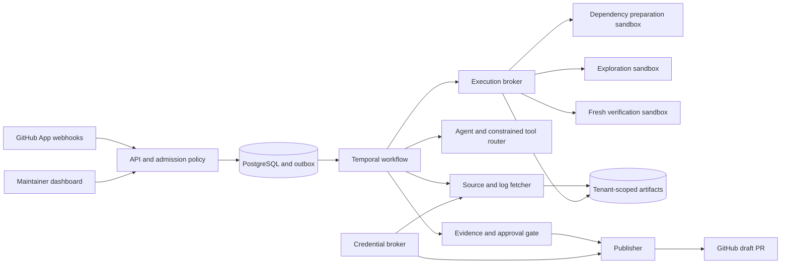

# Architecture

Embedded profile substitutes Temporal with `InvestigationRuntime` and GitHub with `FixtureGitHub`. Those adapters are labeled. Production must bind Temporal workers and the gVisor executor; admission fails closed if `runsc` is missing.
